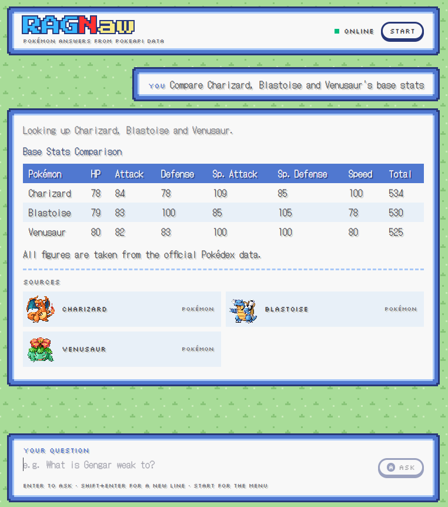
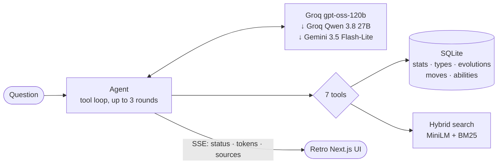

<p align="center">
  
</p>

<p align="center">
  Ask anything about Pokémon and get answers grounded in real data, in a UI that looks like
  a Game Boy Advance dialogue box.
  <br>
  <a href="https://ragnaw.vercel.app"><strong>ragnaw.vercel.app</strong></a>
</p>

<p align="center">
  
</p>

## What it is

RAGNaw is a retrieval-augmented question answerer built on
[PokeAPI](https://pokeapi.co). Ask "what are the Gen 5 starters?", "what beats
Water/Ground?" or "which Pokémon stores electricity in its cheeks?" and an LLM answers by looking
things up, not from memory:

- **Structured questions** (stats, types, matchups, evolutions, moves, abilities) go to
  tools that query a SQLite database, so rankings and type charts are computed, not
  guessed.
- **Descriptive questions** go to hybrid search over Pokédex entries and move and ability
  descriptions.
- **Every answer** is written only from what those lookups returned, and lists the
  entries it drew on.

## How it works



**Data.** An offline pipeline downloads a pinned snapshot of PokeAPI's CSV tables and
builds two artifacts that ship with the backend:

- A **SQLite database**: 1,025 species, 1,254 Pokémon and forms (Megas, regional and
  battle forms kept; cosmetic forms dropped), 919 moves, 314 abilities and 581 evolution
  methods, using latest-generation values.
- A **search index**: 4,099 short chunks of Pokédex entries and move and ability text,
  packed to at most 128 tokens and embedded with MiniLM.

**Retrieval.** Dense (MiniLM) and keyword (BM25) rankings are merged with reciprocal rank
fusion, then boosted for any Pokémon, move or ability named in the question. Name
matching tolerates typos ("pikachoo", "bulbsaur"), but only for words that don't appear
in the data, so "ground" is never corrected into the move Round.

**Tools.** `get_pokemon` (up to 6 at once, with each one's damage chart),
`filter_pokemon`, `get_type_matchups`, `get_evolution_chain`, `get_move`, `get_ability` and
`search_knowledge`. Arguments are validated with Pydantic, and a bad call returns an error
the model can fix rather than an exception.

**Models.** Everything runs on free tiers, so capacity is part of the design. Groq's
limits are per model, so a second Groq model is its own budget: questions go to
gpt-oss-120b, then Qwen 3.8 27B, then Gemini 3.5 Flash-Lite. A rate-limited provider is
skipped for its retry window. Answers stream token by token over Server-Sent Events.

**Interface.** The dialogue frames with stepped pixel corners, the one-pixel text shadow
and the grass tiles are original, drawn in CSS and SVG. A working START menu
opens sample questions, OPTION (text speed drives a typewriter reveal, and there are five
frame styles) and About. Source cards show PokeAPI's pixel sprites (Emerald's for the
first 386).

## Notes from building it

- **One tool call per round.** gpt-oss can't make parallel tool calls, so "the Gen 5
  starters" used up every round on single lookups. `get_pokemon` now takes a list, which
  halved the tokens for list questions.
- **Forcing an answer can fail the answer.** The last round originally sent
  `tool_choice="none"`, and Groq fails the whole response if the model tries a tool
  anyway. The last round now sends no tools at all.
- **Providers validate tool calls differently.** Groq checks arguments against the schema
  on its own servers and fails the stream on a violation, so schema bounds are left out
  and enforced (or clamped) in Pydantic instead. Gemini attaches thought signatures to
  tool calls that must be sent back unchanged, and asking it for usage stats while
  streaming cuts the stream off after one chunk.
- **Grounding needs the data in hand.** Asked what Gengar is weak to, the model once
  answered from memory and claimed 4× Ground. Now every Pokémon lookup includes its
  damage chart.
- **Names beat embeddings.** Dense search alone ranked Sirfetch'd above Farfetch'd for
  "Farfetch'd". BM25 and the name boost fix exact names; typo correction is limited to
  words the data doesn't contain.
- **Pixel fonts have to be readable at size.** Pixelify Sans drew 5 almost exactly like
  S, which broke stat tables. Body text is DotGothic16, set at exactly 16 px, the size
  its pixel grid is drawn for.

## Stack

| | |
|---|---|
| Frontend | Next.js 16, React 19, Tailwind CSS 4, Base UI (via shadcn), next-themes, react-markdown · on Vercel |
| Backend | FastAPI (native SSE), OpenAI SDK against Groq and Gemini, Pydantic, `limits` · Docker on Render |
| Retrieval | fastembed (MiniLM, ONNX), bm25s, rapidfuzz, NumPy |
| Data | PokeAPI CSVs → SQLite, built offline by `ingest/` |
| Tests | 68 backend tests (tools, routing, streaming, fallbacks) and 9 for the data pipeline |

```
frontend/   Next.js app: the retro chat UI
backend/    FastAPI app: agent, tools, search, and the built data in backend/data/
ingest/     Offline pipeline: PokeAPI CSVs → SQLite + search index
```

Each directory's README covers running it locally.

---

Built by [Ahmer Macasindel](https://github.com/Mir-2002). Unofficial fan project, not
affiliated with Nintendo, Game Freak or The Pokémon Company. Pokémon © Nintendo, Game
Freak, Creatures. Data and sprites from [PokeAPI](https://pokeapi.co).
